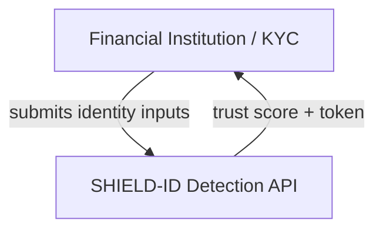

# C4 — <system> (Mermaid, 4 levels)

## L1 Context

## L2 Container · L3 Component · L4 Code
<containers: API · Layer1 · Layer2 · eval harness · data pipeline>
> Lives in `.context/ARCHITECTURE.md`. Instantiate from modelo_documentacao/, extend with ML sections.
